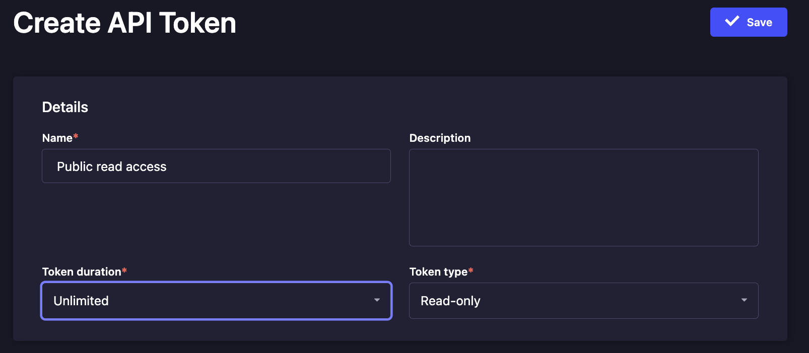

# profekto

Demo project exploring backend/frontend architecture with Strapi and NextJs.

## Up and Running

### Prerequisites

+ Node and Npm
+ Yarn

### Get backend up

#### Enter backend
```bash
cd backend
```

#### Prepare backend
```bash
cp .env.example .env
yarn
```

#### Import data
```bash
npx strapi import --force -f exports/profekto.tar.gz
```

#### Run backend
```bash
yarn develop
```

#### Login to Strapi
Go to http://localhost:1337/admin and login with:

Email: `strapi_admin`
Password: `Strapi_admin1`

#### Create Strapi public token
Go to the `API Tokens` menu point.
Create token and copy it. You need it for the frontend configuration.



### Get frontend up

#### Enter frontend
From the root of the project:

```bash
cd frontend
```

#### Prepare frontend
```bash
cp .env.local.example .env.local
```

Edit the `.env` file and write the Strapi token instead of `INSERT_STRAPI_TOKEN_HERE`.

Now you are ready to run the frontend:

```bash
cp .env.local.example .env
yarn
yarn dev
```

#### Visit frontend
Go to http://localhost:3000

The very first load of the Next application takes time. Be patient 😉